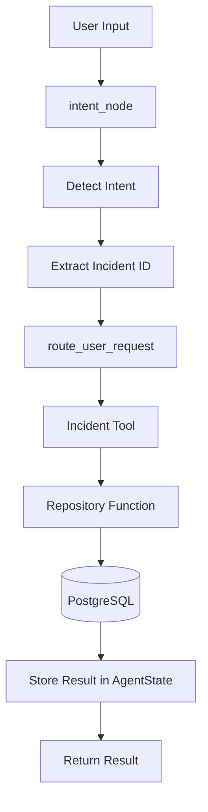
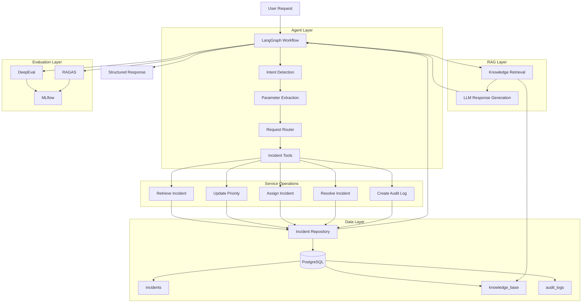

# Incident Management AI Agent

An enterprise-style incident management AI agent built with Python, PostgreSQL, LangChain, and LangGraph.

## Features

- Retrieve incident details
- Update incident priority
- Assign incidents
- Resolve incidents
- Create audit logs
- Route user requests to incident tools
- Extract incident IDs dynamically from user input

## Project Structure

```text
agent/
  incident_tools.py
  router.py
  state.py
  workflow.py

db/
  connection.py
  incident_repository.py

tests/
  test_incident_repository.py
  test_workflow.py

evaluation/
mlflow/
main.py
pyproject.toml
```

## Prerequisites

- Python 3.11 or later
- PostgreSQL
- uv

## Installation

Install the project dependencies:

```bash
uv sync
```

To include future evaluation dependencies:

```bash
uv sync --extra evaluation
```

## Database Configuration

Update the PostgreSQL connection settings in `db/connection.py`:

```python
psycopg2.connect(
    host="localhost",
    database="incident_agent_db",
    user="postgres",
    password="",
)
```

The project expects these tables:

- `incidents`
- `knowledge_base`
- `audit_logs`

## Running the Agent

```bash
uv run python main.py
```

Example input:

```text
Show Incident 15
```

The workflow extracts `incident_id = 15` and retrieves the matching incident from PostgreSQL.

## Running Tests

```bash
uv run pytest
```

## Current Workflow



## Planned Project Architecture



### Layer Responsibilities

1. **User Interface**: Starts with `main.py` and can later become a REST API or web interface.
2. **Agent and Workflow Layer**: Uses shared state, intent detection, parameter extraction, routing, and LangGraph workflow execution.
3. **Tool Layer**: Exposes incident operations while keeping agent logic separate from database logic.
4. **Repository Layer**: Contains PostgreSQL queries for retrieval, creation, assignment, priority updates, resolution, and auditing.
5. **Database Layer**: Stores operational incidents, troubleshooting knowledge, and audit history.
6. **RAG Layer**: Retrieves knowledge-base context and supplies it to an LLM for resolution recommendations.
7. **Evaluation Layer**: Uses DeepEval and RAGAS for quality evaluation, with MLflow tracking experiments and metrics.

### Planned Request Flow

```text
User request
→ LangGraph workflow
→ Detect intent
→ Extract parameters
→ Validate parameters
→ Route to tool
→ Execute repository operation
→ Create audit log
→ Return structured result
→ Record evaluation and tracing data
```

## Current Progress

- PostgreSQL database layer
- Incident repository operations
- Repository unit tests
- Agent state
- Intent detection
- Tool routing
- Incident tools
- Dynamic incident ID extraction
- Workflow tests

## Roadmap

1. Extract parameters for assignment, priority updates, and resolution
2. Execute all incident actions through the workflow
3. Create audit logs for incident changes
4. Build the workflow with LangGraph
5. Add knowledge-base retrieval and RAG
6. Evaluate with DeepEval and RAGAS
7. Track experiments with MLflow
